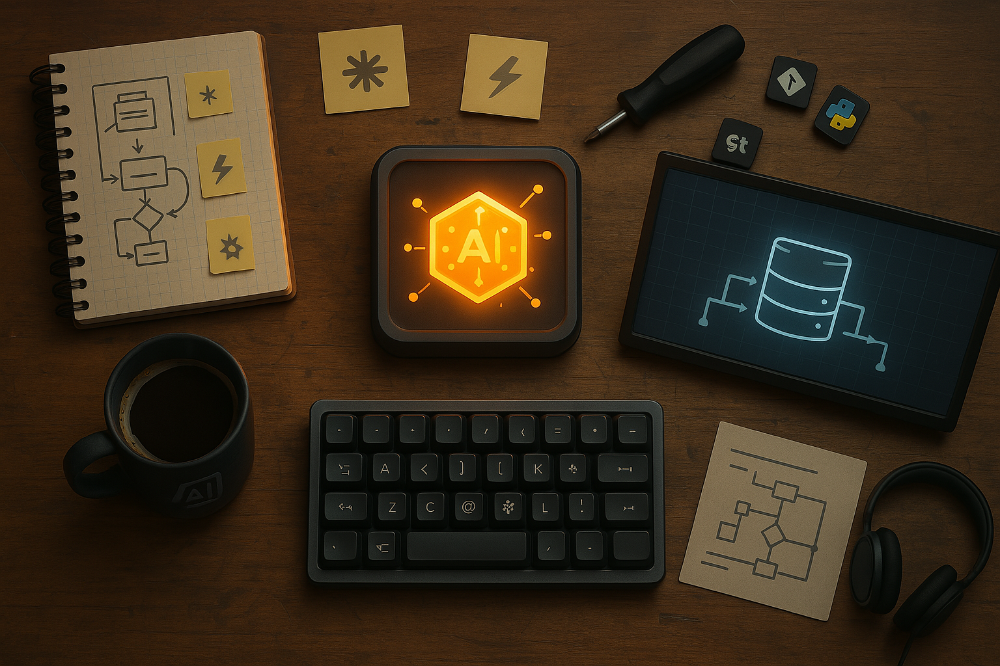

# 🧠 AI Product Development: Community Guide

Welcome to the **Community Guide** — a shared, open repository for learning resources, how-to guides, and real-world workflows in AI product development.

Our goal is to **collaboratively build a practical knowledge base** that helps people move from beginner to confident builder across topics like:

- 🤖 AI Agents & Automation
- 🧩 Low-code / no-code workflows
- 🛠️ Real-world product development
- 🧠 Prompt design and LLM usage
- 🧪 Experimentation, testing, and iteration

---

## Project Resources

*   [Live Coding Outputs](./live-coding-outputs/) - Outputs from live coding sessions.
*   [Session Notes](./session-notes/) - Notes from project sessions.
*   [Tools & Resources](./topics/resources.md) - Curated list of tools, datasets, and references.
*   [AI Agent Prompts](./prompts/) - Prompts used for generating project artifacts.

## 📚 How to Use This Repo

This repository is organized into markdown-based notes inside the `/topics` folder. Browse the guides to explore workflows, learn concepts, or contribute your own!

- [`topics/`](./topics/) — Where all community-contributed guides live.
- [`tools/`](./tools/) — Setup guides for essential development tools.

You can read files directly in GitHub, or clone the repo and open it in VS Code or Obsidian for a better note-taking experience.

---

## ✍️ How to Contribute

1. **Fork** this repository
2. Create a new branch: `git checkout -b my-topic-contribution`
3. Add or update files in `topics/`
4. Commit and push your changes
5. **Create a pull request** with a short description of what you added or changed

📌 Check out [`CONTRIBUTIING.md`](./CONTRIBUTIING.md) for formatting and tone guidelines.

---

## 🔐 Want More?

This repo is the **open foundation** of our learning community. We're building a **paid private group** that includes:

- Advanced agent builds & full projects
- Workshops and live mentoring
- Premium templates and code libraries
- Access to curated datasets, RAG apps, and automation flows

👉 [Join the waitlist](https://airtable.com/appydKBEzaiAhYdQY/pagwwotD9F86LLbK4/form) *(or update with real link)*

---

## 📄 License

All content in this repository is licensed under the [Creative Commons Attribution-NonCommercial 4.0 International License (CC BY-NC 4.0)](https://creativecommons.org/licenses/by-nc/4.0/).

You are free to:
- **Share** — copy and redistribute the material in any medium or format
- **Adapt** — remix, transform, and build upon the material

✅ **Under the following terms:**
- **Attribution** — You must give appropriate credit and link back to this repository.
- **NonCommercial** — You may not use the material for commercial purposes.

💡 *Commercial use of this content is reserved. If you're interested in licensing or collaborating, [contact us](mailto:dave.braendler@productfoundry.ai).*

---

Made with 💡 by the AI Product Development community.
