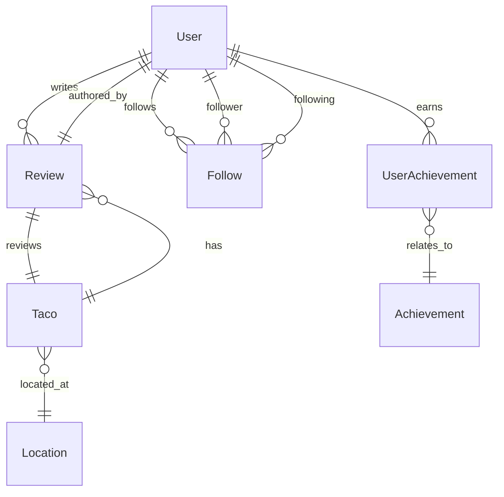

## Database Design Summary

Taco Quest is a community-driven taco discovery platform where users can explore tacos by location, share reviews and ratings, follow other taco lovers, and earn achievements through their activity. This schema supports scalability, consistent naming conventions, and cross-platform compatibility with both Python (SQLModel) and Node.js (Prisma). Emphasis was placed on indexing for performance, normalization for clarity, and flexibility for future features like media uploads or event-based achievements.

---

## Key Entities and Relationships

- **User**: Represents a registered taco lover. Can create reviews, follow others, and earn achievements.
- **Taco**: A taco instance that users can review. Tied to a specific location and vendor.
- **Location**: A physical place where tacos are served. Useful for geo-based search and filtering.
- **Review**: A user's feedback on a taco, with rating and optional comment.
- **Follow**: A many-to-many relationship allowing users to follow each other.
- **Achievement**: A badge or recognition earned based on activity.
- **UserAchievement**: Tracks which achievements a user has earned.

---

## ER Diagram (Mermaid.js)



---

## SQLModel (Python)

```python
from sqlmodel import SQLModel, Field, Relationship
from typing import Optional, List
from datetime import datetime

class User(SQLModel, table=True):
    id: int = Field(default=None, primary_key=True)
    username: str = Field(index=True, unique=True)
    email: str = Field(index=True, unique=True)
    created_at: datetime = Field(default_factory=datetime.utcnow)

    reviews: List['Review'] = Relationship(back_populates='user')
    achievements: List['UserAchievement'] = Relationship(back_populates='user')
    following: List['Follow'] = Relationship(back_populates='follower', sa_relationship_kwargs={"foreign_keys": '[Follow.follower_id]'})
    followers: List['Follow'] = Relationship(back_populates='following', sa_relationship_kwargs={"foreign_keys": '[Follow.following_id]'})

class Location(SQLModel, table=True):
    id: int = Field(default=None, primary_key=True)
    name: str
    address: str
    lat: float
    lon: float

    tacos: List['Taco'] = Relationship(back_populates='location')

class Taco(SQLModel, table=True):
    id: int = Field(default=None, primary_key=True)
    name: str
    description: Optional[str]
    location_id: int = Field(foreign_key='location.id')

    location: Location = Relationship(back_populates='tacos')
    reviews: List['Review'] = Relationship(back_populates='taco')

class Review(SQLModel, table=True):
    id: int = Field(default=None, primary_key=True)
    user_id: int = Field(foreign_key='user.id')
    taco_id: int = Field(foreign_key='taco.id')
    rating: int
    comment: Optional[str]
    created_at: datetime = Field(default_factory=datetime.utcnow)

    user: User = Relationship(back_populates='reviews')
    taco: Taco = Relationship(back_populates='reviews')

class Follow(SQLModel, table=True):
    id: int = Field(default=None, primary_key=True)
    follower_id: int = Field(foreign_key='user.id')
    following_id: int = Field(foreign_key='user.id')
    created_at: datetime = Field(default_factory=datetime.utcnow)

    follower: User = Relationship(back_populates='following', sa_relationship_kwargs={"foreign_keys": '[Follow.follower_id]'})
    following: User = Relationship(back_populates='followers', sa_relationship_kwargs={"foreign_keys": '[Follow.following_id]'})

class Achievement(SQLModel, table=True):
    id: int = Field(default=None, primary_key=True)
    name: str
    description: str

    users: List['UserAchievement'] = Relationship(back_populates='achievement')

class UserAchievement(SQLModel, table=True):
    id: int = Field(default=None, primary_key=True)
    user_id: int = Field(foreign_key='user.id')
    achievement_id: int = Field(foreign_key='achievement.id')
    earned_at: datetime = Field(default_factory=datetime.utcnow)

    user: User = Relationship(back_populates='achievements')
    achievement: Achievement = Relationship(back_populates='users')
```

---

## Prisma Schema (Node.js)

```prisma
model User {
  id              Int              @id @default(autoincrement())
  username        String           @unique
  email           String           @unique
  createdAt       DateTime         @default(now())
  reviews         Review[]
  achievements    UserAchievement[]
  following       Follow[]         @relation("UserFollowing")
  followers       Follow[]         @relation("UserFollowers")
}

model Location {
  id        Int     @id @default(autoincrement())
  name      String
  address   String
  lat       Float
  lon       Float
  tacos     Taco[]
}

model Taco {
  id          Int       @id @default(autoincrement())
  name        String
  description String?
  locationId  Int
  location    Location @relation(fields: [locationId], references: [id])
  reviews     Review[]
}

model Review {
  id        Int      @id @default(autoincrement())
  userId    Int
  tacoId    Int
  rating    Int
  comment   String?
  createdAt DateTime @default(now())

  user      User     @relation(fields: [userId], references: [id])
  taco      Taco     @relation(fields: [tacoId], references: [id])
}

model Follow {
  id           Int      @id @default(autoincrement())
  followerId   Int
  followingId  Int
  createdAt    DateTime @default(now())

  follower     User     @relation("UserFollowing", fields: [followerId], references: [id])
  following    User     @relation("UserFollowers", fields: [followingId], references: [id])
}

model Achievement {
  id          Int               @id @default(autoincrement())
  name        String
  description String
  users       UserAchievement[]
}

model UserAchievement {
  id             Int         @id @default(autoincrement())
  userId         Int
  achievementId  Int
  earnedAt       DateTime    @default(now())

  user           User        @relation(fields: [userId], references: [id])
  achievement    Achievement @relation(fields: [achievementId], references: [id])
}
```

---

## Assumptions & Design Notes

- **Users must register with unique usernames and emails**.
- **Follow relationships are unidirectional**, allowing asymmetric follow (like Twitter).
- **Tacos are associated with a specific location**, not globally listed.
- **Review ratings are integers** (e.g., 1–5). Future schemas may include structured sentiment.
- **Indexes** on usernames, emails, and foreign keys improve lookup speeds.
- **Achievement logic is application-driven** rather than enforced via schema triggers.
- **Tables are normalized**, reducing redundancy and improving maintainability.
- The schema is **ready for expansion**, including media tables, category tags, and enhanced user profiles.

