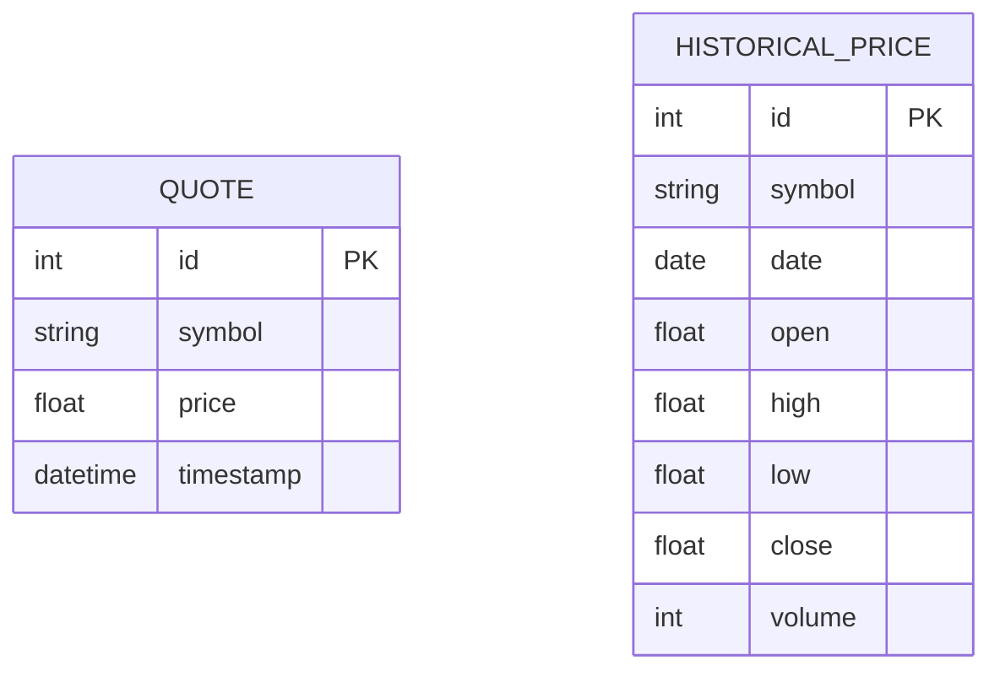

# Database Design: Mock Stock Market Data API (SQLite/SQLModel Prototype)

## 1. Database Design Summary

This document outlines the database design for the Mock Stock Market Data API prototype, utilizing **SQLite** as the database and **SQLModel** as the ORM in Python. The primary goal is to define data structures representing mock stock quotes and historical prices. While data might still be generated on-the-fly for API responses, using SQLite allows for potential persistence of generated data or configuration, making the prototype slightly more realistic. These SQLModel definitions provide a clear structure for both the database tables and the data being served.

## 2. Key Entities and Relationships

*   **`Quote`**: Represents a single, point-in-time mock stock quote for a specific symbol. Potentially stored in the database.
*   **`HistoricalPrice`**: Represents a single data point (e.g., daily OHLCV - Open, High, Low, Close, Volume) for a specific symbol on a specific date. Potentially stored in the database.

There are no explicit relationships defined between these models in the database for this simple prototype, as data is primarily requested per symbol.

## 3. ER Diagram (Optional but Recommended)



*(Diagram shows the two main entities and their attributes as defined in SQLModel. PK = Primary Key, UQ = Unique Constraint)*

## 4. SQLModel Schema (Python/SQLite)

These models define the structure of the data returned by the API and potentially stored in the SQLite database.

```python
# models.py (Example SQLModel definitions)

from sqlmodel import SQLModel, Field, UniqueConstraint
from typing import Optional
from datetime import datetime, date

class QuoteBase(SQLModel):
    symbol: str = Field(index=True)
    price: float
    timestamp: datetime

class Quote(QuoteBase, table=True):
    # If storing quotes persistently
    id: Optional[int] = Field(default=None, primary_key=True)

class QuoteRead(QuoteBase):
    # Pydantic model for API response (might not need ID)
    pass

class HistoricalPriceBase(SQLModel):
    symbol: str = Field(index=True)
    date: date
    open: float
    high: float
    low: float
    close: float
    volume: int

class HistoricalPrice(HistoricalPriceBase, table=True):
    # If storing historical data persistently
    id: Optional[int] = Field(default=None, primary_key=True)
    # Add unique constraint for symbol+date if storing
    __table_args__ = (UniqueConstraint("symbol", "date", name="uq_symbol_date"),)

class HistoricalPriceRead(HistoricalPriceBase):
    # Pydantic model for API response
    pass

```

## 5. Prisma Schema (Node.js - Secondary)

*(Omitted for this Python/SQLite focused prototype)*

## 6. Design Rationale & Assumptions

*   **Prototype Focus:** The design prioritizes simplicity for the initial prototype using SQLite.
*   **Mock Data Generation:** It's assumed that the primary mechanism for providing data might still be on-the-fly generation, but SQLite provides an option for storing reference data or configurations.
*   **SQLModel Usage:** The SQLModel classes serve as data structure definitions for API responses and as database table definitions (`table=True`).
*   **SQLite Limitations:** No complex relational features or high-concurrency writes are anticipated, making SQLite suitable for this prototype.
*   **Indexing:** Basic indexing on `symbol` is included. A unique constraint on `symbol` and `date` for `HistoricalPrice` is added for data integrity if storing historical data.
*   **No Relationships:** Direct database relationships between `Quote` and `HistoricalPrice` are not necessary for the core functionality described in the PRD.

---
*Generated based on 04_data_architect prompt, SA.md, PRD, and user request to reintroduce SQLite.*
