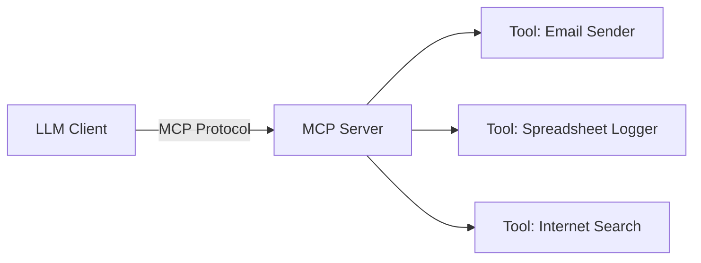

# 🧠 Understanding MCP: A Unified Interface for LLMs and Tools

## 🔍 What Is MCP (Model Context Protocol)?
MCP is a **standardized protocol** that allows large language models (LLMs) to connect to external tools and services in a **unified, scalable, and structured** way.

Without MCP:
- Every integration is bespoke.
- APIs feel like different "languages".
- It becomes hard to maintain and scale multi-tool assistants.

With MCP:
- Tools and services speak a **common language**.
- LLMs can **interact with services more meaningfully**.
- Developers can build richer assistants without gluing everything manually.

### History and Adoption
MCP was introduced by Anthropic in late 2024. While initially slow to gain traction, interest surged in early 2025 as more companies and developers recognized its potential for standardizing tool integration. Major players like OpenAI began supporting it, leading to rapid ecosystem growth. It's often compared to HTTP in its potential impact on standardizing interactions, but for AI tools.

---

## 🧰 The Problem MCP Solves
LLMs like ChatGPT or Claude are great at **text prediction**, but they can't:
- Send real emails
- Query live data
- Interact with tools

### The Evolution:
| Generation | Capability | Limitation |
|------------|------------|-------------|
| 1️⃣ LLM Only | Answer questions, generate text | Can't take action |
| 2️⃣ LLM + Tools | Can access APIs/services | Friction in wiring tools together |
| 3️⃣ LLM + MCP | Seamless, standardized tool interaction | Easy to scale, maintain |

---

## 🧱 Components of the MCP Ecosystem

| Component | Role | Description | Examples |
|----------|------|-------------|----------|
| **MCP Client** | Interface | The LLM-facing agent or application that initiates requests. | Claude Desktop, Cursor IDE, Custom Scripts |
| **MCP Protocol** | Bridge | Defines how clients and servers communicate (often JSON over HTTP/SSE/STDIO). | - |
| **MCP Server** | Translator | Receives client requests, invokes the correct tool, and returns results. | Self-hosted n8n ([03](./03-N8N-selfhost+mcp.md)/[04](./04-N8N-ServerNode.md)), Custom Python Server ([09-FastMCP-GCP-Example.md](./09-FastMCP-GCP-Example.md)) |
| **Service/Tool** | Functionality | The actual external capability being exposed (e.g., sending email, querying a database). | Gmail API, Database Query, Web Search |

---

## 🧠 How It Works

> Think of MCP as a **universal translator** between LLMs and external services.

### Transport Mechanisms: STDIO vs. SSE
MCP servers and clients can communicate in different ways:
- **STDIO (Standard Input/Output):** Communication happens via the standard input/output streams. This is simple for local development where the client and server run on the same machine, often managed by a single process or script.
- **SSE (Server-Sent Events):** Communication uses standard HTTP(S). The server pushes updates to the client over a persistent connection. This is ideal for production, networked environments where the server might run remotely. See [02-Transport-Mechanisms.md](./02-Transport-Mechanisms.md) for more details.

### Without MCP:
> Each tool requires custom integration logic, error handling, glue code, and manual configuration.

### With MCP:
> Tools are exposed via a common format. The LLM only needs to understand the MCP standard once.

---

## 🧪 Startup Potential

- **MCP App Store**: A marketplace of pre-built MCP servers you can "click to deploy."
- **Deployment Tools**: Easy wrappers to convert an API into an MCP-compatible server.
- **Tool Hosting**: Host tools that others can use via MCP (e.g., PDF summarizer, email manager).
- **Observability & Monitoring**: Add logging, analytics, rate limiting for MCP servers.

---

## ⚠️ Early Days, But Big Potential

While it's not finalized:
- Keep an eye on standard evolution (Anthropic, etc.)
- Experiment with small-scale tools
- Build up intuition so when the standard locks in, you're ready

> "MCP is to LLM tools what HTTP was to the early internet."

---

## 🧭 Summary Interface

| Element | What It Does | Why It Matters |
|--------|---------------|----------------|
| `Client` | User interface (e.g., chatbot) | Sends user queries and receives responses |
| `Protocol` | JSON-based messaging standard | Ensures consistency across clients and servers |
| `Server` | Routes, transforms, and handles requests | Isolates LLMs from tool-specific quirks |
| `Tool` | Executes a task (e.g., send SMS, fetch data) | Makes LLMs capable of taking action |

---

## 💡 Final Thought
MCP is not just a trend—it's a **pragmatic leap** in how we build intelligent systems. It paves the way for:
- More capable AI agents
- Easier tool integrations
- Scalable infrastructure for assistants

Stay tuned. The ecosystem is just getting started. 🚀

---

## 📚 Implementation Examples

See the following notes for practical guides:
- **Using the Python SDK (`mcp-cli`):** [05-Python-SDK-Implementation.md](./05-Python-SDK-Implementation.md) and [06-Integrating-MCP-with-LLMs.md](./06-Integrating-MCP-with-LLMs.md)
- **Using n8n:** [03-N8N-selfhost+mcp.md](./03-N8N-selfhost+mcp.md) and [04-N8N-ServerNode.md](./04-N8N-ServerNode.md)
- **Building a Custom Python Server (FastMCP/GCP Example):** [09-FastMCP-GCP-Example.md](./09-FastMCP-GCP-Example.md)

---
*Licensed under the [Creative Commons Attribution-NonCommercial 4.0 International License (CC BY-NC 4.0)](https://creativecommons.org/licenses/by-nc/4.0/)*
*Visit [ProductFoundry.ai](https://productfoundry.ai)*
